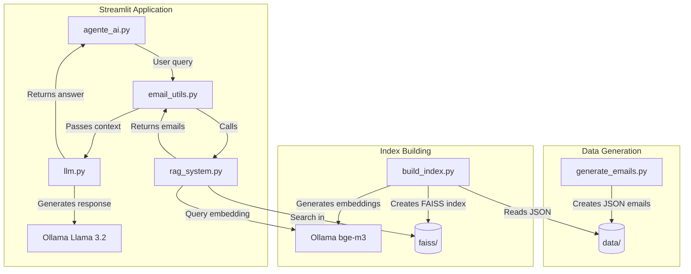
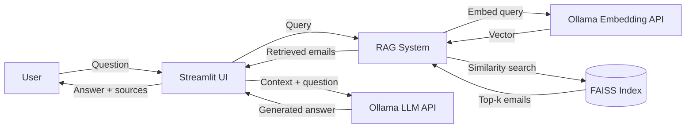
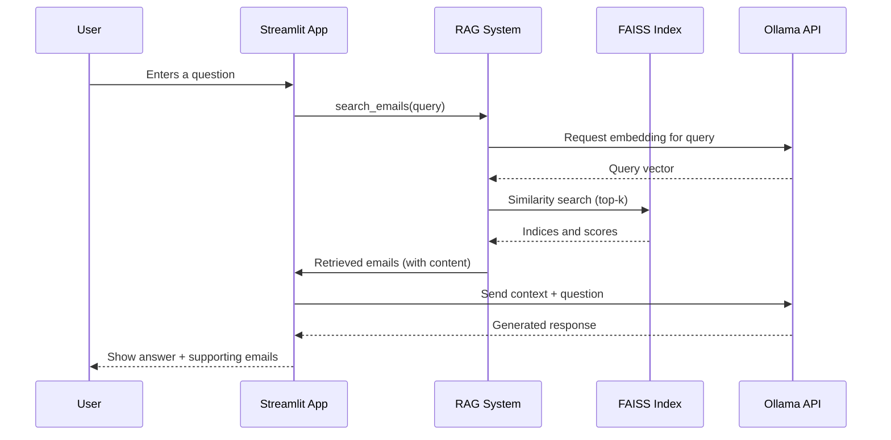

# Local RAG – Email Assistant

A first attempt to build a local RAG (Retrieval-Augmented Generation) system, based on Ollama, in order to have a personal assistant that can answer questions about your personal email archive.

This project implements an intelligent assistant for searching and retrieving information from an email archive. It uses a complete RAG pipeline with FAISS for vector retrieval and Ollama (with the Llama 3.2 model) for response generation. The user interface is built with Streamlit.

---

## Table of Contents

- [Overview](#overview)
- [Key Features](#key-features)
- [System Architecture](#system-architecture)
  - [Component Diagram](#component-diagram)
  - [Data Flow Diagram](#data-flow-diagram)
  - [Sequence Diagram](#sequence-diagram)
- [Project Structure](#project-structure)
- [Installation & Setup](#installation--setup)
  - [Prerequisites](#prerequisites)
  - [Quick Start with Docker](#quick-start-with-docker)
  - [Manual Setup (without Docker)](#manual-setup-without-docker)
- [Usage](#usage)
- [Configuration](#configuration)
- [Extending the System](#extending-the-system)
- [License](#license)

---

## Overview

The **Local RAG Email Assistant** enables you to:

- Ingest a collection of emails (stored as JSON files).
- Build a semantic search index using state‑of‑the‑art embeddings.
- Ask natural‑language questions about your emails.
- Receive contextual, accurate answers generated by a local LLM, complete with references to the source emails.

All processing happens locally – your data never leaves your machine.

---

## Key Features

- **Semantic email search:** Uses the `bge-m3` embedding model via Ollama for high‑quality vector representations.
- **FAISS vector index:** Enables fast and scalable similarity searches over thousands of emails.
- **Local LLM generation:** Leverages Ollama with the `llama3.2` model to produce contextual, human‑like answers.
- **Interactive web interface:** Built with Streamlit for a clean and intuitive user experience.
- **Synthetic email generation:** Includes a script (`generate_emails.py`) that uses OpenAI GPT‑4o‑mini to create realistic test emails.
- **Fully configurable:** Easy to adapt to different email sources, embedding models, or LLMs.
- **Docker‑ready:** Run the entire stack with a single `docker compose up` command.

---

## System Architecture

The system is composed of three main stages:
1. **Data generation:** Creating or placing email JSON files.
2. **Index building:** Generating embeddings and building the FAISS index.
3. **Query & generation:** The Streamlit app that handles user queries, retrieves relevant emails, and produces answers.

### Component Diagram



### Data Flow Diagram



### Sequence Diagram



---

## Project Structure

```text
.
├── agente_ai.py          # Streamlit web application (main entry point)
├── build_index.py        # Script to build the FAISS index from email JSONs
├── email_utils.py        # Helper functions for reading and searching emails
├── generate_emails.py    # Synthetic email generator (uses OpenAI API)
├── llm.py                # Interface to Ollama (Llama 3.2)
├── rag_system.py         # Core RAG system (embedding + retrieval)
├── data/                 # Folder containing email JSON files
├── faiss/                # Folder containing the FAISS index and metadata
├── .env                  # Environment variables (not committed)
├── docker-compose.yml    # Docker Compose configuration
└── requirements.txt      # Python dependencies
```

---

## Installation & Setup

### Prerequisites

- **Docker** (recommended) or **Python 3.10+** with `pip`
- **Ollama** running locally (if not using Docker) – you need to pull the `bge-m3` and `llama3.2` models:

```bash
ollama pull bge-m3
ollama pull llama3.2
```

### Quick Start with Docker

This is the easiest way to get the system up and running.

1. **Clone the repository:**
   ```bash
   git clone [https://github.com/MattiaLupinetti02/local_RAG.git](https://github.com/MattiaLupinetti02/local_RAG.git)
   cd local_RAG
   ```

2. **Build the Docker images:**
   ```bash
   docker compose build
   ```

3. **Start the containers:**
   ```bash
   docker compose up
   ```

4. **Access the Streamlit interface:**
   Open your browser and navigate to `http://localhost:8501`.

> **Note:** The first time you run the system, it will generate synthetic emails and build the FAISS index automatically. This may take a few minutes.

---

### Manual Setup (without Docker)

If you prefer to run the system natively:

1. **Clone the repository:**
   ```bash
   git clone [https://github.com/MattiaLupinetti02/local_RAG.git](https://github.com/MattiaLupinetti02/local_RAG.git)
   cd local_RAG
   ```

2. **Create and activate a virtual environment (optional but recommended):**
   ```bash
   python -m venv venv
   source venv/bin/activate   # On Windows use: venv\Scripts\activate
   ```

3. **Install dependencies:**
   ```bash
   pip install -r requirements.txt
   ```

4. **Set up environment variables:**
   Create a `.env` file in the project root with the following content:
   ```env
   OLLAMA_BASE_URL=http://localhost:11434
   OPENAI_API_KEY=your_openai_key_here   # Only needed for synthetic email generation
   ```

5. **Generate synthetic emails (optional):**
   ```bash
   python generate_emails.py
   ```
   *This will create a set of sample emails in the `data/` folder.*

6. **Build the FAISS index:**
   ```bash
   python build_index.py
   ```

7. **Launch the Streamlit app:**
   ```bash
   streamlit run agente_ai.py
   ```

8. Open your browser at `http://localhost:8501`.

---

## Usage

Once the application is running:

1. Type your question in the text input field (e.g., *"What were the meeting notes from last week?"* or *"Who sent the invoice for project X?"*).
2. The system will:
   - Embed your query.
   - Search the FAISS index for the most relevant emails.
   - Pass the retrieved email content (as context) together with your question to the LLM.
3. The answer will appear on the screen, along with a list of the source emails that were used to generate it.
4. You can adjust the number of retrieved emails (`top_k`) in `rag_system.py` or via the Streamlit sidebar (if exposed).

---

## Configuration

Key configuration parameters are stored in:

- **`.env`** – For sensitive variables like API keys and service URLs.
- **`docker-compose.yml`** – For Docker‑specific settings (ports, volumes, environment variables).
- **`rag_system.py`** – Change embedding model settings, FAISS index parameters, and `top_k` document retrieval.
- **`llm.py`** – Switch to a different Ollama model by updating the `model_name` parameter.

---

## Extending the System

- **Add your own emails:** Place additional JSON files in the `data/` folder (each file containing email objects with fields like `subject`, `sender`, `date`, `body`) and rerun `python build_index.py`.
- **Change the embedding model:** Update `model_name` in `rag_system.py` to any embedding model supported by Ollama.
- **Switch the LLM:** Modify `model_name` in `llm.py` to use a different model (e.g., `mistral`, `llama3.2`, `phi3`).
- **Use a different vector database:** Replace FAISS with ChromaDB, Qdrant, or Weaviate by updating the retrieval logic in `rag_system.py`.
- **Add a feedback mechanism:** Extend the Streamlit interface to collect user ratings on response quality.

---

## License

This project is open‑source and available under the **MIT License**.
