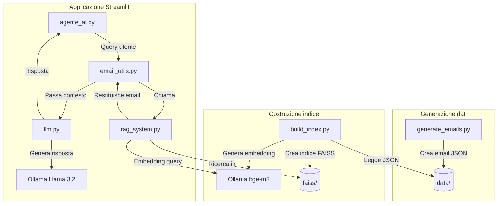
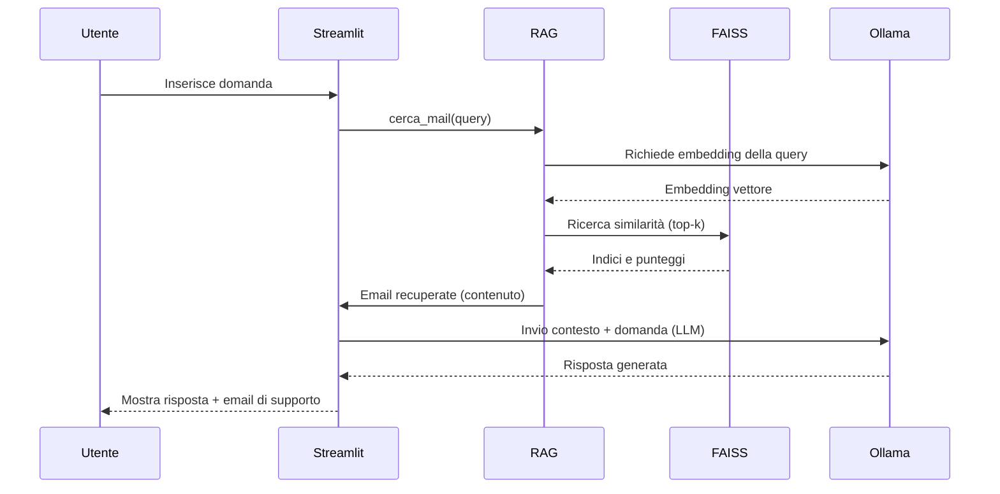

# Email Assistant – Assistente Email con RAG

Questo progetto implementa un assistente intelligente per la ricerca e il recupero di informazioni da un archivio di email. Utilizza una pipeline RAG (Retrieval-Augmented Generation) basata su FAISS per il recupero vettoriale e Ollama con il modello Llama 3.2 per la generazione delle risposte. L'interfaccia utente è realizzata con Streamlit.

## Caratteristiche

- Ricerca semantica delle email tramite embedding (modello bge-m3).
- Indice vettoriale FAISS per ricerche rapide e scalabili.
- Generazione di risposte contestuali grazie a un LLM locale (Llama 3.2).
- Interfaccia web interattiva e intuitiva con Streamlit.
- Generazione automatica di email fittizie per il test (tramite OpenAI GPT-4o-mini).
- Configurabile e facilmente estendibile.

## Architettura del sistema

### Struttura dei file
.
├── agente_ai.py         Interfaccia Streamlit
├── build_index.py       Creazione indice FAISS
├── email_utils.py       Helper per lettura e ricerca email
├── generate_emails.py   Generazione sintetica email (OpenAI)
├── llm.py               nterfaccia per Ollama (Llama 3.2)
├── rag_system.py        Sistema RAG (embedding + ricerca)
├── data/                Cartella contenente i file JSON delle email
├── faiss/               Cartella contenente indice e metadati
├── .env                 Variabili d'ambiente (non committato)
└── requirements.txt     Dipendenze Python




## Installazione e avvio
### Required: docker
- Clona il repository
```
git clone https://github.com/MattiaLupinetti02/local_RAG.git
cd local_RAG
```
- crea le immagini necessarie prima di eseguire i container
  ```
  docker compose build
  ```
- esegui i container
  ```
  docker compose up
  ```
## quickstart
Per accedere all'interfaccia *streamlit* è necessario accedere alla porta 8501 (modificabile nel *docker-compose.yml*) con `https://localhost:8501


