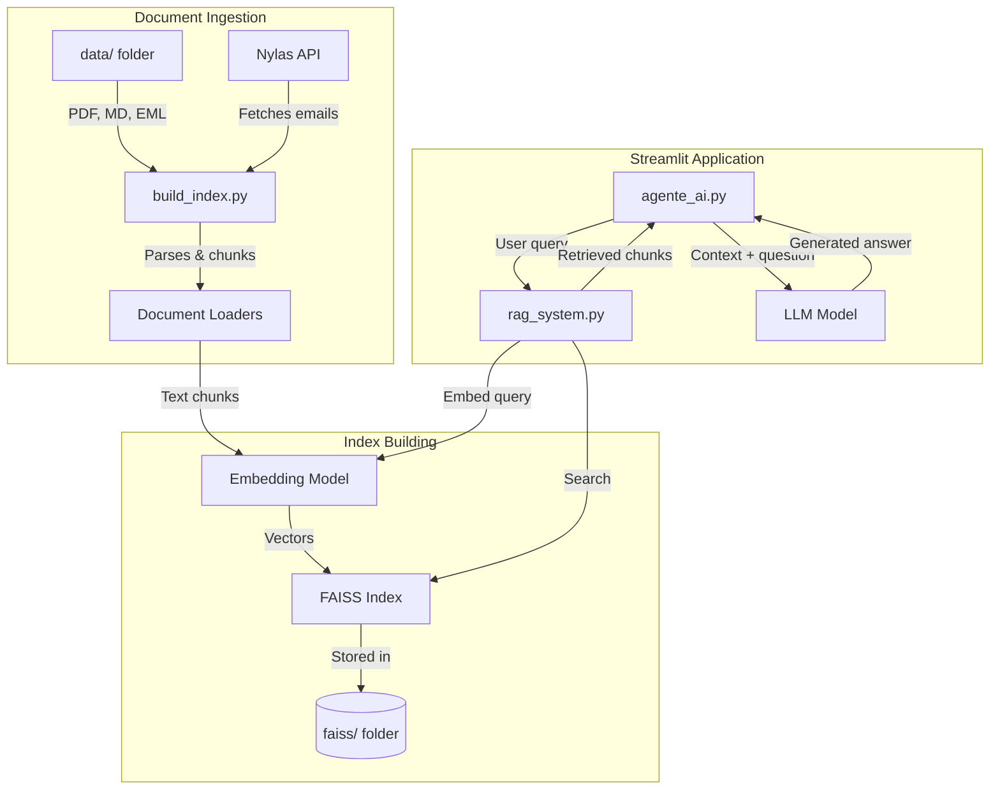
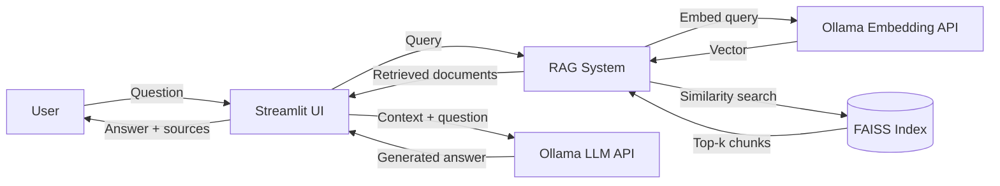

# Local RAG – Multi‑Format Document Assistant

A fully local **Retrieval-Augmented Generation (RAG)** system that enables you to query your personal knowledge base containing **emails, Markdown files, and PDFs**. Built with **FAISS** for vector retrieval and **Ollama** for local embeddings and LLM inference, it provides accurate, context‑aware answers with source references – all without sending your data to the cloud.

---

## Table of Contents

- [Overview](#overview)
- [Key Features](#key-features)
- [System Architecture](#system-architecture)
  - [Component Diagram](#component-diagram)
  - [Data Flow Diagram](#data-flow-diagram)
  - [Sequence Diagram](#sequence-diagram)
- [Project Structure](#project-structure)
- [Installation & Setup](#installation--setup)
  - [Prerequisites](#prerequisites)
  - [Quick Start with Docker](#quick-start-with-docker)
  - [Manual Setup (without Docker)](#manual-setup-without-docker)
- [Environment Configuration](#environment-configuration)
- [Usage](#usage)
- [Configuration](#configuration)
- [Extending the System](#extending-the-system)
- [License](#license)

---

## Overview

The **Local RAG Multi‑Format Assistant** enables you to:

- Ingest documents from multiple formats: **PDFs** (`.pdf`), **Markdown** (`.md`), and **emails** (locally stored `.eml` files or directly fetched via the **Nylas** API).
- Build a semantic search index using state‑of‑the‑art embedding models.
- Ask natural‑language questions that span across all your documents.
- Receive accurate, context‑aware answers generated by a local LLM, complete with citations to the original source files.

All processing happens **locally** – your data remains private and secure on your own machine.

---

## Key Features

- **Multi‑format ingestion** – supports PDF, Markdown, and email (EML / Nylas) out of the box.
- **Semantic retrieval** – uses your chosen embedding model (e.g., `bge-m3`, `nomic-embed-text`) via Ollama.
- **FAISS vector index** – enables fast, scalable similarity searches over thousands of documents.
- **Local LLM generation** – leverages Ollama with your preferred model (e.g., `llama3.2`, `mistral`, `phi3`).
- **Nylas integration** – optionally fetch real email threads directly using your Nylas credentials.
- **Fully configurable via `.env`** – all models, paths, thresholds, and API keys are managed in a single environment file (not committed to the repo).
- **Interactive web interface** – built with Streamlit for a clean and intuitive user experience.
- **Docker‑ready** – run the entire stack with a single `docker compose up` command.

---

## System Architecture

The system is composed of three main stages:

1. **Document ingestion** – loads and parses PDF, Markdown, and email files from the data folder (or via Nylas).
2. **Index building** – chunks the extracted text, generates embeddings, and builds the FAISS index.
3. **Query & generation** – the Streamlit app handles user queries, retrieves relevant chunks, and generates answers.

### Component Diagram



### Data Flow Diagram

The following diagram shows how data moves through the system during a typical query:



### Sequence Diagram

This diagram details the interaction flow for a single user query:


---

## Project Structure

```text
.
├── agente_ai.py          # Streamlit web application (main entry point)
├── build_index.py        # Script to ingest documents and build the FAISS index
├── rag_system.py         # Core RAG system (embedding + retrieval)
├── llm.py                # Interface to Ollama for generation
├── document_loaders.py   # Modular loaders for PDF, MD, EML
├── data/                 # Folder containing your documents (PDF, MD, EML)
├── faiss/                # Folder containing the FAISS index and metadata
├── .env                  # Environment variables (not committed – see template below)
├── docker-compose.yml    # Docker Compose configuration
└── requirements.txt      # Python dependencies (includes pypdf, markdown, nylas, etc.)
```

---

## Installation & Setup

### Prerequisites

- **Docker** (recommended) or **Python 3.10+** with `pip`
- **Ollama** running locally (if not using Docker) – pull your chosen embedding and generation models:

```bash
ollama pull bge-m3          # Example embedding model
ollama pull llama3.2        # Example generation model
```

### Quick Start with Docker

This is the easiest way to get the system up and running.

1. **Clone the repository:**
   ```bash
   git clone [https://github.com/MattiaLupinetti02/local_RAG.git](https://github.com/MattiaLupinetti02/local_RAG.git)
   cd local_RAG
   ```

2. **Create your `.env` file:**
   Copy the template from the [Environment Configuration](#environment-configuration) section below into a new `.env` file in the project root.

3. **Place your documents:**
   Add your PDF, Markdown, and/or EML files into the `data/` folder (or change `DATA_FOLDER` in `.env`).

4. **Build and start the containers:**
   ```bash
   docker compose build
   docker compose up
   ```

5. **Access the Streamlit interface:**
   Open your browser and navigate to `http://localhost:8501`.

> **Note:** The first time you run the system, it will automatically ingest all documents in `DATA_FOLDER` and build the FAISS index. This may take a few minutes depending on the number and size of your documents.

---

### Manual Setup (without Docker)

If you prefer to run the system natively:

1. **Clone the repository:**
   ```bash
   git clone [https://github.com/MattiaLupinetti02/local_RAG.git](https://github.com/MattiaLupinetti02/local_RAG.git)
   cd local_RAG
   ```

2. **Create and activate a virtual environment (optional but recommended):**
   ```bash
   python -m venv venv
   source venv/bin/activate   # On Windows use: venv\Scripts\activate
   ```

3. **Install dependencies:**
   ```bash
   pip install -r requirements.txt
   ```

4. **Create your `.env` file:**
   Use the template provided in the next section.

5. **Place your documents in the `data/` folder.**

6. **Build the FAISS index:**
   ```bash
   python build_index.py
   ```

7. **Launch the Streamlit app:**
   ```bash
   streamlit run agente_ai.py
   ```

8. Open the app at `http://localhost:8501`.

---

## Environment Configuration

All configuration is managed via a `.env` file in the project root. This file is not committed to the repository for security reasons. Create it manually with the following template:

```env
# -------------------------------
# Paths & Folders
# -------------------------------
DATA_FOLDER="data"                     # Folder containing PDF, MD, EML files
INDEX_FOLDER="faiss"                   # Folder to store the FAISS index and metadata

# -------------------------------
# Embedding & Retrieval Settings
# -------------------------------
EMBEDDING_MODEL="bge-m3"               # Ollama embedding model
SIMILARITY_THRESHOLD="0.5"             # Minimum similarity score (0-1) for retrieval
TOP_K_EMBEDDING_MODEL="10"             # Number of chunks to retrieve from FAISS
TOP_K_RERANKER="5"                     # Number of chunks to pass to the LLM after optional reranking

# -------------------------------
# Generation (LLM) Settings
# -------------------------------
MODEL="llama3.2"                       # Ollama generation model

# -------------------------------
# Ollama Server Settings
# -------------------------------
OLLAMA_HOST="http://localhost:11434"   # URL of the Ollama service
OLLAMA_KEEP_ALIVE="5m"                 # How long to keep models loaded in memory
OLLAMA_MAX_LOADED_MODELS="1"           # Max number of models kept loaded simultaneously
OLLAMA_NUM_PARALLEL="1"                # Number of parallel requests to the LLM

# -------------------------------
# Nylas Integration (for real email fetching)
# -------------------------------
NYLAS_API_KEY="your_nylas_api_key_here"
NYLAS_GRANT_ID="your_nylas_grant_id_here"

# -------------------------------
# Indexing & Processing Flags
# -------------------------------
INDEX_DOCUMENT="true"                  # Whether to build/rebuild the index on startup
METADATA_DOCUMENT="true"               # Whether to store document metadata in the index
BATCH_SIZE="32"                        # Number of chunks to process per batch during embedding
```

> **Important:** If you do not wish to use Nylas, simply leave `NYLAS_API_KEY` and `NYLAS_GRANT_ID` empty – the system will fall back to processing only local files in `DATA_FOLDER`.

---

## Usage

Once the application is running:

1. Type your question in the text input field – for example:
   - *"What were the key decisions in the Q3 planning meeting?"*
   - *"Summarise the security policy outlined in the compliance PDF."*
   - *"Show me the latest email thread regarding the server migration."*
2. The system will:
   - Embed your query.
   - Search the FAISS index for the most relevant document chunks (across all formats).
   - Pass the retrieved chunks (as context) together with your question to the LLM.
3. The answer will appear on the screen, along with a list of the source files and exact chunks that were used to generate it – so you can easily verify the information.
4. You can adjust the retrieval parameters (`TOP_K_EMBEDDING_MODEL`, `TOP_K_RERANKER`, `SIMILARITY_THRESHOLD`) directly in the `.env` file and restart the app, or expose them via the Streamlit sidebar.

---

## Configuration

Key configuration parameters are managed exclusively via the `.env` file:

- **Paths:** `DATA_FOLDER`, `INDEX_FOLDER`.
- **Models:** `EMBEDDING_MODEL` and `MODEL`.
- **Retrieval:** `TOP_K_EMBEDDING_MODEL`, `TOP_K_RERANKER`, `SIMILARITY_THRESHOLD`.
- **Ollama performance:** `OLLAMA_KEEP_ALIVE`, `OLLAMA_MAX_LOADED_MODELS`, `OLLAMA_NUM_PARALLEL`.
- **External services:** `NYLAS_API_KEY` and `NYLAS_GRANT_ID` for real email ingestion.
- **Processing:** `BATCH_SIZE` controls how many chunks are embedded at once (useful for large document sets).

---

## Extending the System

- **Add a new document format:** Implement a new loader in `document_loaders.py` (e.g., for Word `.docx`, HTML, or plain text) and register it in the ingestion pipeline.
- **Change the embedding or generation model:** Update `EMBEDDING_MODEL` or `MODEL` in `.env` to any model supported by Ollama (e.g., `nomic-embed-text`, `mistral`, `phi3`).
- **Replace the vector database:** Swap FAISS for ChromaDB, Qdrant, Weaviate, or LanceDB by modifying the `rag_system.py` module.
- **Add chunking strategies:** Customise the chunk size, overlap, or splitting logic inside `build_index.py`.
- **Enable hybrid search:** Combine semantic retrieval with keyword‑based search (BM25) for improved recall.
- **Add user feedback:** Extend the Streamlit app to collect feedback on answers, which can be used to fine‑tune retrieval or generation over time.

---

## License

This project is open‑source and available under the **MIT License**.
